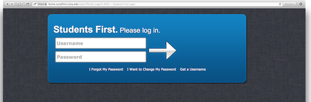

Students First
=============

If you're a student at any one of the 23 City Universities of New York, you've been coerced into using this archaic shopping cart named CUNY First. 	

Students First is a userscript which makes CUNY First easier to use. In a manner of speaking, it puts the students first.

If you're faculty, don't use this yet, because Students First skips the main menu, and jumps to the Student Center. You'll miss your stop. Once I can see what the faculty login/menu looks like, I can wire it all up correctly. Hang tight for now.

What Does it Do?
---

Students first makes several changes to CUNY First.

1. The login screen is improved. It looks nicer and will allow you to save your username in the browser if you'd like.
2. Once logged in, Students First takes you straight to the Student Center. Goodbye "HR/Self Service".
3. Cuny First menus are cleaned up. Instead of that page-in-a-page, you get just what you're looking for.
4. I've removed the images from the Student Center menus, because they were ugly. I may put them back in the future.
5. When you log out, you'll be automatically redirected to the login page. 

Setting It Up:
---

If you're on a Mac, you can install it in Safari by downloading [this file](https://github.com/MosheBerman/StudentsFirst/blob/master/extensions/safari/output/StudentsFirst.safariextz?raw=true). Just double click it, and Safari will install it.

If you're using Chrome, download [first.user.js](https://raw.github.com/MosheBerman/StudentsFirst/master/first.user.js) and install it. Open Settings, click "Extensions", and drag it in. For Firefox, the process shoulf br di

System Requirements:
---
Students First has been developed on Chrome and Safari for Mac OS X 10.8. 

I've run it on Safari, Chrome, and Firefox for OS X. It's been tested, and is known to work on Chrome for Windows.

To run the Safari extension, you'll need Safari 5.0 or higher. (In Safari 5, you'll have to enable extensions.) 

How it Works:
---
Students First is like putting a little makeup on CUNY First. It doesn't change anything about the system, but it changes CUNY First, so it looks more attractive. 

From a technical perspective, Students First is a userscript that rewrites parts of the CUNY First webpages' DOM on the fly to insert custom CSS and custom DOM nodes where necessary.

Is It Secure?
---

Students First never touches your personal information, nor does it change anything on CUNY's servers. 